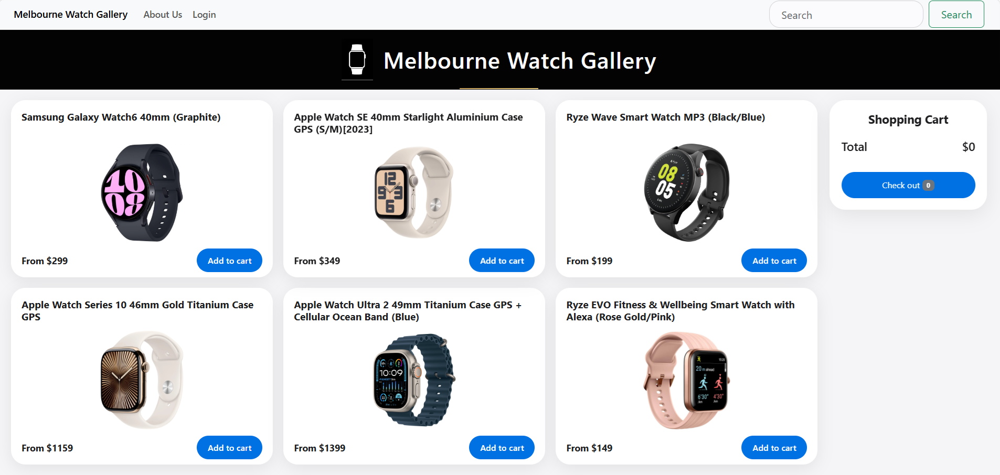
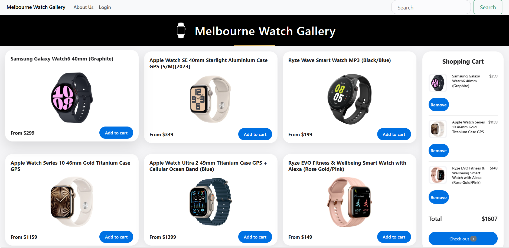
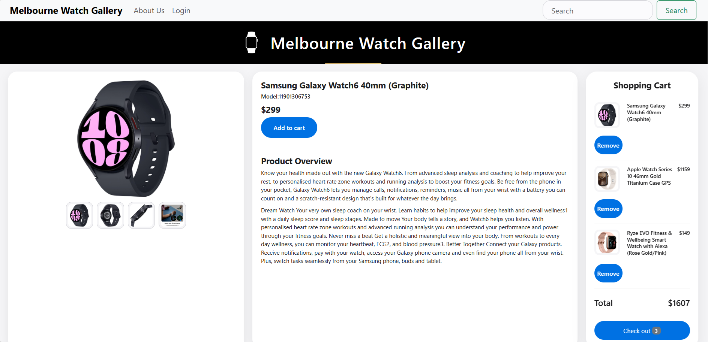
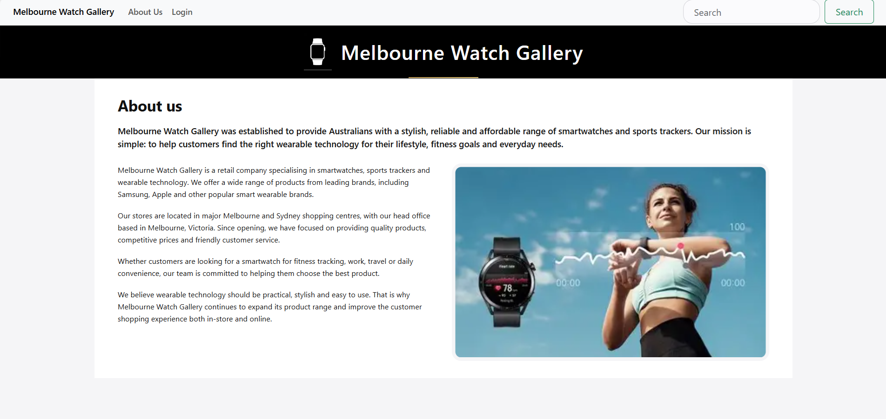
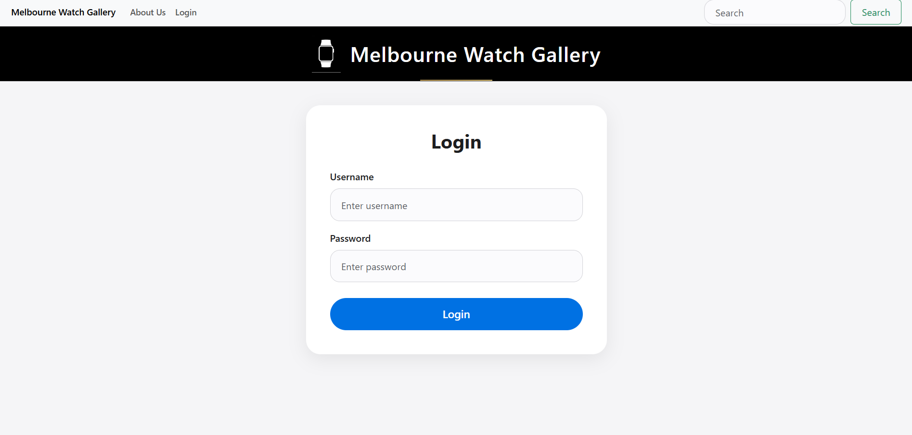
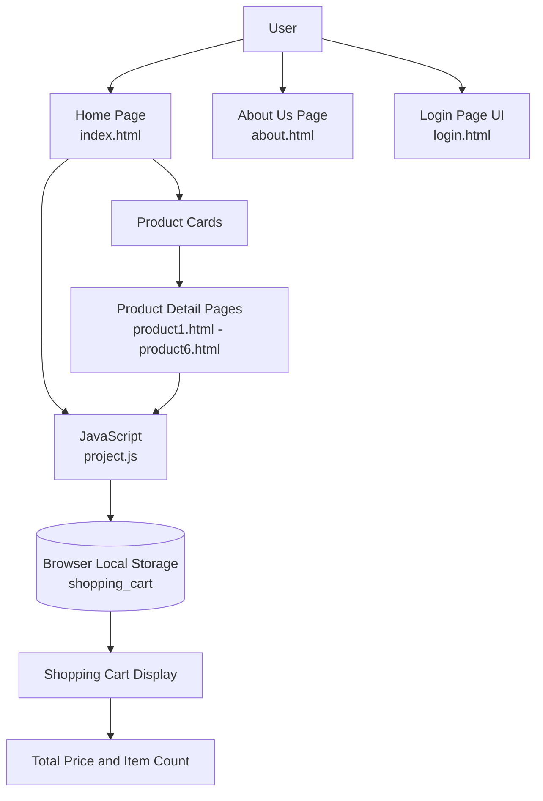

# Melbourne Watch Gallery HTML

A responsive static e-commerce website for smart watches, built with HTML, CSS, JavaScript and Bootstrap.



---

## Live Demo

View the website on GitHub Pages:

```text
https://evaliu-tech.github.io/melbourne-watch-gallery-html/
```

---

## Project Description

Melbourne Watch Gallery HTML is a responsive static e-commerce website for browsing smart watches and wearable technology products.

The website allows users to view product listings, open individual product detail pages, add products to a shopping cart, and view the total price. The shopping cart is handled using JavaScript and browser `localStorage`.

This project was created to demonstrate front-end web development skills, including HTML structure, CSS styling, Bootstrap layout, JavaScript DOM manipulation, localStorage, responsive design, and GitHub Pages deployment.

---

## Features

- Responsive e-commerce website layout
- Product listing homepage
- Individual product detail pages
- Product image gallery with hover image change
- Shopping cart using JavaScript localStorage
- Add to cart function
- Remove item from cart function
- Total price calculation
- Item count display
- About Us page
- Login page UI
- Shared CSS styling
- GitHub Pages deployment

---

## Technologies Used

### Front-End

- HTML5
- CSS3
- JavaScript
- Bootstrap 5

### Tools

- Visual Studio Code
- GitHub
- GitHub Pages

---

## Screenshots

### Home Page


### Shopping Cart



### Product Detail Page



### About Us Page



### Login Page



---

## System Workflow



---

## Data Flow Description

The website is a static front-end project. It does not use a backend server or database.

Product information is written directly inside HTML files. JavaScript is used to handle shopping cart actions, including adding products, removing products, displaying cart items, calculating the total price, and updating the item count.

The shopping cart data is stored in the browser using `localStorage`, so cart items can remain available even after refreshing the page.

---

## Project Structure

```text
melbourne-watch-gallery-html/
│
├── README.md
├── index.html
│
├── pages/
│   ├── about.html
│   ├── login.html
│   ├── product1.html
│   ├── product2.html
│   ├── product3.html
│   ├── product4.html
│   ├── product5.html
│   └── product6.html
│
└── assets/
    ├── css/
    │   └── style.css
    │
    ├── js/
    │   └── project.js
    │
    └── screenshots/
        ├── home.png
        ├── aboutus.png
        ├── login.png
        ├── cart.png
        └── product.png
```

---

## Installation and Setup

This is a static website, so it does not require XAMPP, PHP, MySQL, or any backend setup.

### 1. Clone the repository

```bash
git clone https://github.com/evaliu-tech/melbourne-watch-gallery-html.git
```

### 2. Open the project folder

```bash
cd melbourne-watch-gallery-html
```

### 3. Open the website

Open this file directly in a browser:

```text
index.html
```

Or use Visual Studio Code Live Server.

---

## Main Pages

| Page | Description |
|---|---|
| `index.html` | Homepage with product listings and shopping cart |
| `pages/about.html` | About Us page |
| `pages/login.html` | Login page UI |
| `pages/product1.html` | Product detail page for Samsung Galaxy Watch6 |
| `pages/product2.html` | Product detail page for Apple Watch SE |
| `pages/product3.html` | Product detail page for Ryze Wave Smart Watch |
| `pages/product4.html` | Product detail page for Apple Watch Series 10 |
| `pages/product5.html` | Product detail page for Apple Watch Ultra |
| `pages/product6.html` | Product detail page for Ryze EVO Smart Watch |

---

## Shopping Cart Function

The shopping cart is handled with JavaScript and browser `localStorage`.

Main cart functions:

- Add product to cart
- Remove product from cart
- Display product image, name, and price
- Calculate total price
- Display item count
- Keep cart data after page refresh

---

## JavaScript Functions

| Function | Description |
|---|---|
| `getShoppingCart()` | Gets cart data from localStorage |
| `saveShoppingCart()` | Saves cart data to localStorage |
| `add_item()` | Adds product from homepage to cart |
| `add_item2()` | Adds product from product detail page to cart |
| `display_shoppingcart()` | Displays cart items and total price |
| `remove_item()` | Removes selected product from cart |
| `change_image()` | Changes main product image on hover |

---

## UI Design Highlights

- Clean and modern layout
- Responsive product grid
- Product detail pages with image gallery
- Sticky shopping cart sidebar
- Rounded product cards and buttons
- Consistent navigation bar and header
- Shared `style.css` for all pages
- Simple and user-friendly shopping cart interface

---

## Deployment

This project is deployed using GitHub Pages.

GitHub Pages is suitable for this project because it is a static website built with HTML, CSS and JavaScript.

---

## Note

This is the static HTML version of Melbourne Watch Gallery.

It does not include PHP, MySQL, admin login validation, or database CRUD functions.

For the PHP and MySQL version, please see:

```text
melbourne-watch-gallery-php
```

---

## Future Improvements

- Add real search function
- Add product filter by brand or price
- Add checkout page
- Add user registration page UI
- Improve mobile layout
- Add more product categories
- Connect to a backend system in the future

---

## Project Purpose

This project was created to demonstrate:

- HTML page structure
- CSS styling and responsive layout
- Bootstrap components
- JavaScript DOM manipulation
- Browser localStorage usage
- Static website deployment with GitHub Pages
- Front-end e-commerce website workflow

---

## Author

**Eva Liu**

GitHub: [evaliu-tech](https://github.com/evaliu-tech)
